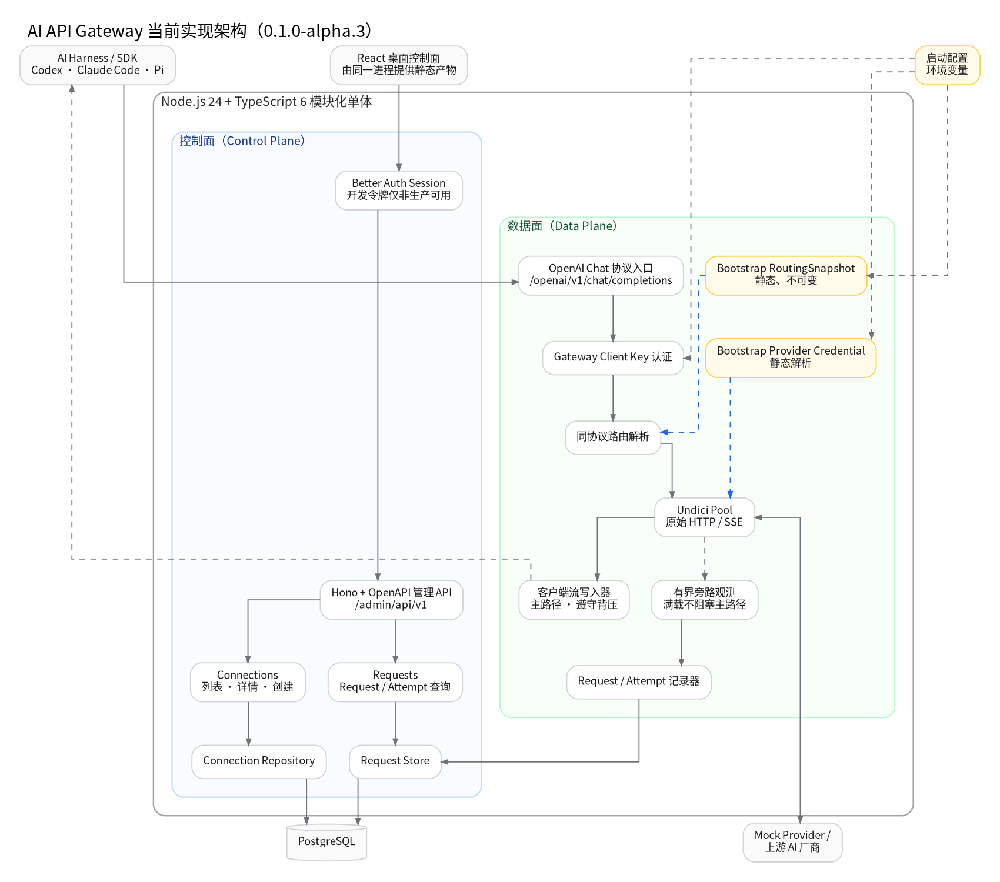

# 当前实现状态



本文件只描述当前源码已经提供的能力，不把目标设计冒充为已实现产品。

## 已稳定的工程接缝

以下模式可以被后续 Feature 复制：

- 无 Import 副作用的显式 Application Composition；
- 控制面与数据面使用不同 HTTP 契约；
- 控制面采用 `routes.ts → handlers.ts → service.ts → index.ts`；
- 数据面完整 Provider Body 使用宽松 JSON，未知字段不被不完整 DTO 过滤；
- 热路径从不可变 `RoutingSnapshot` 读取路由决定；
- Gateway Client Key 与 Provider Credential 使用不同类型和所有者；
- 主流旁边使用有界、非阻塞观测；
- `Request` 与 `Attempt` 分开持久化；
- 单元、协议、PostgreSQL、浏览器和编译产物是不同证据层；
- TypeScript 6.0.3 由根 Workspace 单独拥有；
- Web 基础组件采用 shadcn `base-nova` 与 Base UI，配置、依赖和 Primitive 由工具链门禁固定；
- 通用 Lint 基线采用 `@antfu/eslint-config`，项目只叠加架构边界与质量棘轮；
- Web TypeScript 拆分 Browser App 与 Node Tooling 两个 Project Reference；
- Change Scope、证据选择和 Gate DAG 是统一质量入口；
- Routing、Transport、Recording、Observation 和 Shutdown 拥有运行时不变量；
- Keyless Snapshot 同时固定 Provider 实收、Client 实收和 Request/Attempt；
- CI 分为 Static、Core、Protocol 和 Artifact 四个证明面；
- Postmortem 与简化审计分别负责把逃逸缺陷变成永久 Guard、删除无主代码。

## 已实现的控制面

- 健康检查；
- Connection 列表、详情和创建；
- Request 列表和 Request/Attempt 详情；
- Better Auth 接口和仅开发环境可用的控制面令牌；
- OpenAPI 静态导出与 Scalar Reference；
- 前端 OpenAPI 类型生成及新鲜度检查；
- Memory 与 PostgreSQL Repository Adapter。

## 已实现的数据面

- `POST /openai/v1/chat/completions`；
- Gateway Client Key 验证；
- 单个 Bootstrap `RoutingSnapshot`；
- Undici 按 Origin 管理连接池；
- 原始请求正文转发；
- 上游 SSE Chunk 按顺序透传；
- 客户端取消传播；
- 有界字节 Observer；
- Request/Attempt 开始与完成记录；
- Keyless Mock Provider 协议黄金路径。

## 当前 Bootstrap 实现

以下实现只是验证架构，不应被扩展成通用框架：

- 一个来自环境变量的 Gateway Client Key；
- 一个来自环境变量的 Provider Credential；
- 一个保持请求模型不变的静态路由；
- 仅 OpenAI Chat Completions 一个数据面协议；
- 依赖安装前的 Bootstrap Web API 类型；
- 无 npm Registry 环境下尚未运行真实 shadcn / Antfu 初始化器和完整依赖探针；
- 单元和浏览器测试使用的 Memory Adapter。

后续应在现有接口后替换这些实现，而不是建立第二套并行结构。

## 下一条纵向切片

```text
Connection + Account + 加密 Credential
→ RouteRule 编辑器
→ Snapshot Compiler
→ 原子发布
→ Data Plane 消费发布版本
→ Request 详情解释规则、目标和凭据
```

应先完成这条链路，再扩展广泛分析功能或第三种协议。
