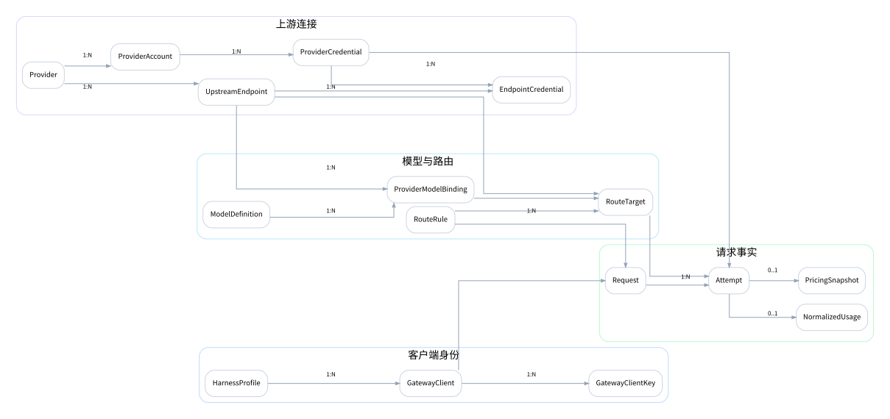
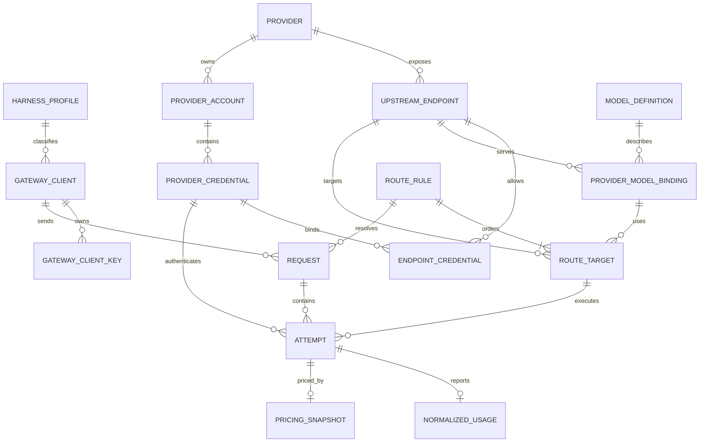

# 领域模型

## 1. 建模目标

领域模型需要准确表达四组互不混淆的关系：

1. **谁发起请求**：HarnessProfile、GatewayClient、GatewayClientKey。
2. **请求可发到哪里**：Provider、UpstreamEndpoint、ProviderModelBinding。
3. **使用谁的额度**：ProviderAccount、ProviderCredential、EndpointCredential。
4. **实际发生了什么**：RouteRule、RouteTarget、Request、Attempt、Usage、Cost。

UI 可以隐藏部分实体，但后端模型不可合并这些职责。

## 2. 核心关系图





## 3. 客户端身份

### 3.1 HarnessProfile

表示一类 Harness 的行为模板，而不是一个具体安装实例。

关键字段：

```text
id
slug                        codex / claude-code / pi / generic-openai
name
allowed_ingress_protocols[]
default_base_path
model_catalog_mode          codex | openai | none
config_template_kind
default_timeout_ms
created_at
updated_at
```

约束：

- `slug` 全局唯一；
- HarnessProfile 不保存 Secret；
- Profile 只提供默认值，GatewayClient 可收紧权限但不能扩大到 Profile 未允许的协议。

### 3.2 GatewayClient

表示一个具体 Harness 实例，例如：

```text
Codex - Arch 工作站
Codex - Windows
Claude Code - 个人项目
Pi - 服务器
```

关键字段：

```text
id
harness_profile_id
name
status                       active | disabled
allowed_protocols[]
route_scope                  可选标签或 RouteGroup
cost_limit_daily             可选
cost_limit_monthly           可选
metadata_json
last_used_at
created_at
updated_at
```

### 3.3 GatewayClientKey

关键字段：

```text
id
client_id
key_prefix
key_last4
secret_hash
hash_algorithm
status                       active | expiring | revoked
expires_at
last_used_at
created_at
revoked_at
```

安全约束：完整 Key 只在创建时返回一次，数据库只保存不可逆哈希、前缀和末四位。

## 4. Provider 与 Endpoint

### 4.1 Provider

表示厂商品牌或服务组织，不直接等于 Base URL 或 API Key。

```text
id
slug                         deepseek / zhipu / kimi / custom-xxx
name
preset_kind                  built_in | custom
logo_source
status                       active | disabled
notes
created_at
updated_at
```

### 4.2 UpstreamEndpoint

表示一个具体协议入口，是路由目标的基础单位。

```text
id
provider_id
name
protocol                     openai_chat | openai_responses | anthropic_messages
base_url
request_path
models_path                  可选
auth_scheme                  bearer | x_api_key | custom_headers
transport                    http_sse | http_json | websocket
supports_streaming
supports_websocket
request_timeout_ms
stream_idle_timeout_ms
compatibility_status         verified | documented | partial | unverified | blocked
status                       active | disabled | unhealthy
headers_json
query_json
created_at
updated_at
```

重要约束：

- 一个 Endpoint 只绑定一个入口协议；
- `base_url + request_path` 必须形成明确 URL，不根据厂商名推断路径；
- RouteTarget.protocol 必须等于 Endpoint.protocol；
- `blocked` Endpoint 不能作为该 Harness Profile 的目标。

## 5. Account 与 Credential

### 5.1 ProviderAccount

表示账号、套餐或计费身份。一个账号可以拥有多个可轮换 Credential。

```text
id
provider_id
name
billing_mode                 metered | subscription | free | custom | unknown
billing_plan_name
currency
status                       active | disabled
metadata_json
created_at
updated_at
```

### 5.2 ProviderCredential

表示一个可用于上游鉴权的 Secret。

```text
id
account_id
name
credential_kind              api_key | bearer_token | custom_header_set
encrypted_secret
secret_key_id
fingerprint
masked_display
status                       unverified | healthy | cooldown | auth_failed | unavailable | disabled
cooldown_until
last_success_at
last_failure_at
last_error_code
last_error_message_redacted
created_at
updated_at
rotated_at
```

完整 Secret 必须使用应用主密钥加密，不能只哈希，因为运行时需要解密调用上游。

### 5.3 EndpointCredential

多对多绑定，表达某个 Credential 是否可用于某个 Endpoint。

```text
endpoint_id
credential_id
enabled
priority                     数字越小优先级越高
weight                       MVP 默认 1
header_overrides_json
query_overrides_json
created_at
```

这样可以表达：

- 同一个普通 API Key 可用于 Chat 和 Responses；
- Coding Plan Key 只能用于专属 Endpoint；
- 同账号的不同 Key 分别绑定不同入口；
- 某个 Key 临时只用于测试，不参与生产路由。

## 6. 模型目录

### 6.1 ModelDefinition

表示与具体 Endpoint 无关的基础模型概念。

```text
id
canonical_slug
name
vendor_family
release_date
status
metadata_json
created_at
updated_at
```

### 6.2 ProviderModelBinding

表示某个 Endpoint 真实接受的模型 ID。

```text
id
endpoint_id
model_definition_id          可空，未匹配基础模型时允许
upstream_model_id
name
status                       available | deprecated | unavailable | unverified
context_window
max_input_tokens
max_output_tokens
input_modalities[]
output_modalities[]
capabilities_json
models_dev_provider_id
models_dev_model_id
metadata_source_snapshot_id
created_at
updated_at
```

能力和限制主要挂在 ProviderModelBinding，而不是基础 ModelDefinition，因为相同模型在不同 Endpoint 上的实现可能不同。

## 7. 路由

### 7.1 RouteRule

MVP 直接在 RouteRule 中保存模型匹配，不单独创建 ModelAlias 表，避免 ModelAlias 与 RouteRule 职责重叠。未来若多个路由需要共享一个命名别名，可通过 ADR 增加。

```text
id
name
scope_type                   client | harness | global
scope_id                     client/harness 时必填
protocol
matcher_type                 exact | prefix | glob | regex
model_pattern
priority                     数字越大越优先
enabled
description
created_at
updated_at
```

### 7.2 RouteTarget

```text
id
route_rule_id
sequence                     从 1 开始
endpoint_id
provider_model_binding_id
account_selection_mode       automatic | account_group | pinned_account | pinned_credential
account_selector_id          可空
request_patch_set_id         可空
request_timeout_ms           可空
max_attempts_on_target       默认 1
enabled
created_at
updated_at
```

RouteTarget 顺序只在同协议内用于故障回退，不表示能力或质量自动选择。

### 7.3 RequestPatchSet / RequestPatch

```text
RequestPatchSet
- id
- name
- description

RequestPatch
- id
- patch_set_id
- location                    header | query | body
- path                        Header 名、Query 名或 JSON Pointer
- mode                        default_if_absent | force | reject_on_conflict
- value_json
- protected_override          必须显式 false，MVP 不允许 true
- sequence
```

## 8. 请求与 Attempt

### 8.1 Request

表示客户端视角的一次逻辑调用。

```text
id                            gateway_request_id
client_id
harness_profile_id
ingress_protocol
ingress_path
requested_model
resolved_route_rule_id
route_snapshot_json
stream
started_at
first_upstream_byte_at
first_semantic_output_at
completed_at
final_status                  succeeded | failed | cancelled | interrupted
http_status
semantic_status
attempt_count
final_provider_id
final_endpoint_id
final_upstream_model
normalized_usage_json
estimated_cost
reported_cost
cost_status
compatibility_warnings_json
raw_request_ref
raw_response_ref
payload_policy
error_category
error_code
error_message_redacted
```

### 8.2 Attempt

表示一次真实上游 HTTP 调用。

```text
id
request_id
sequence
route_target_id
provider_id
endpoint_id
account_id
credential_id
requested_model
upstream_request_model
upstream_reported_model
upstream_request_id
started_at
connected_at
first_byte_at
first_semantic_output_at
completed_at
status                        succeeded | failed | cancelled | interrupted
http_status
semantic_status
retry_reason
error_category
error_code
error_message_redacted
raw_usage_json
normalized_usage_id
pricing_snapshot_id
reported_cost
estimated_cost
```

## 9. Usage 与 Cost

### 9.1 NormalizedUsage

```text
input_tokens
output_tokens
reasoning_tokens
cache_read_tokens
cache_write_tokens
audio_input_tokens
audio_output_tokens
total_tokens
source                       reported | calculated | estimated | unknown
complete                     boolean
```

### 9.2 PricingSnapshot

```text
currency
unit                          per_million_tokens
input_rate
output_rate
reasoning_rate
cache_read_rate
cache_write_rate
audio_input_rate
audio_output_rate
source                        models_dev | provider | manual | account_override
source_version
captured_at
```

## 10. 兼容性

### 10.1 CompatibilityProfile

绑定 Endpoint 与 HarnessProfile：

```text
endpoint_id
harness_profile_id
status                       verified | documented | partial | unverified | blocked
last_probe_at
last_documented_at
summary
```

### 10.2 CompatibilityFact

字段或能力级事实：

```text
profile_id
feature_key                  reasoning.summary / tools.apply_patch / input.image
support_level                supported | partial | ignored | unsupported | degraded | unknown
evidence_source              documented | probed | manual
evidence_ref
verified_model_id
verified_at
notes
```

CompatibilityFact 不参与运行时自动换模型。

## 11. 删除与审计策略

- Provider 被删除前必须没有活跃 RouteTarget；推荐软删除。
- Credential 删除后历史 Attempt 保留 `credential_id` 的匿名快照，不保留 Secret。
- GatewayClient 删除前应先撤销所有 Key；历史 Request 保留客户端名称快照。
- RouteRule 修改后，旧 Request 保留 `route_snapshot_json`。
- PricingRule 修改后，旧 Attempt 保留 PricingSnapshot。
- Raw Payload 可按保留策略删除，但 Request/Attempt 最小元数据应独立保留。

## 12. 关键数据库约束

```text
UNIQUE harness_profile.slug
UNIQUE provider.slug
UNIQUE gateway_client_key.secret_hash
UNIQUE upstream_endpoint(provider_id, name)
UNIQUE provider_model_binding(endpoint_id, upstream_model_id)
UNIQUE endpoint_credential(endpoint_id, credential_id)
UNIQUE route_target(route_rule_id, sequence)
UNIQUE attempt(request_id, sequence)
CHECK route_target.endpoint.protocol = route_rule.protocol  # 应用层 + 事务验证
CHECK cooldown_until IS NULL OR status = cooldown
```

跨表协议一致性无法通过普通 CHECK 实现时，应在服务层和数据库触发器/约束测试中双重保证。
