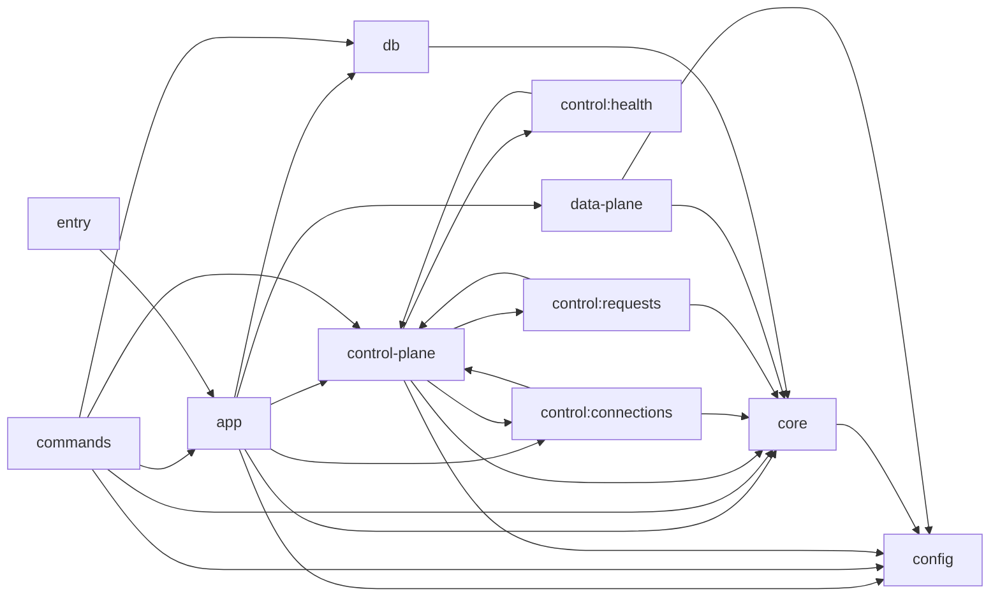
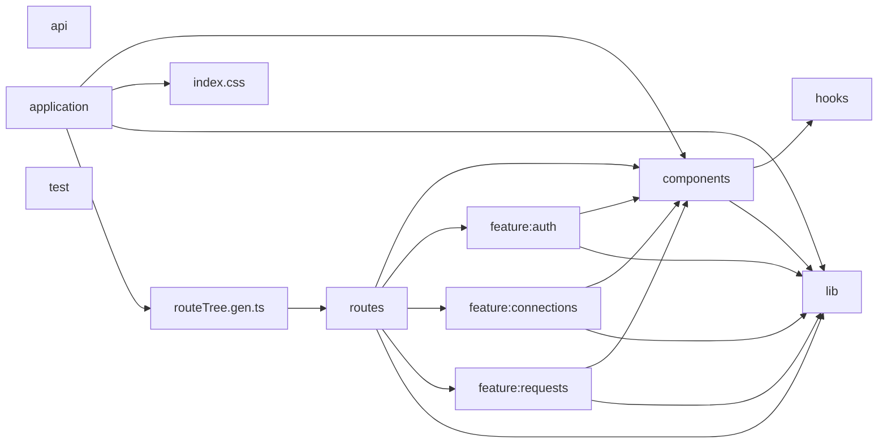

<!-- GENERATED FILE. DO NOT EDIT. -->
<!-- Source: current TypeScript import graph. Run `pnpm docs:module-graph`. -->

# 当前模块依赖图

本文件由生产源码中的静态 Import 自动生成，用于发现实际依赖方向与架构文档漂移。它描述当前事实，不替代 `eslint-plugin-boundaries` 的允许矩阵。

## Gateway 模块依赖

| From | To | 代表性 Import |
| --- | --- | --- |
| `app` | `config` | `apps/gateway/src/app/create-dependencies.ts → apps/gateway/src/config/env-schema.ts` `apps/gateway/src/app/lifecycle.ts → apps/gateway/src/config/env.ts` |
| `app` | `control-plane` | `apps/gateway/src/app/bindings.ts → apps/gateway/src/control-plane/auth/contracts.ts` `apps/gateway/src/app/bindings.ts → apps/gateway/src/control-plane/dependencies.ts` `apps/gateway/src/app/create-application.ts → apps/gateway/src/control-plane/create-control-plane.ts` |
| `app` | `control:connections` | `apps/gateway/src/app/adapters/memory-connection-repository.ts → apps/gateway/src/control-plane/features/connections/contracts.ts` `apps/gateway/src/app/adapters/postgres-connection-repository.ts → apps/gateway/src/control-plane/features/connections/contracts.ts` |
| `app` | `core` | `apps/gateway/src/app/adapters/memory-connection-repository.ts → apps/gateway/src/core/errors/app-error.ts` `apps/gateway/src/app/adapters/memory-connection-repository.ts → apps/gateway/src/core/time/clock.ts` `apps/gateway/src/app/adapters/memory-request-store.ts → apps/gateway/src/core/requests/contracts.ts` |
| `app` | `data-plane` | `apps/gateway/src/app/adapters/memory-request-store.ts → apps/gateway/src/data-plane/recording/invariant.ts` `apps/gateway/src/app/adapters/postgres-request-store.ts → apps/gateway/src/data-plane/recording/invariant.ts` `apps/gateway/src/app/bindings.ts → apps/gateway/src/data-plane/credentials/contracts.ts` |
| `app` | `db` | `apps/gateway/src/app/adapters/postgres-connection-repository.ts → apps/gateway/src/db/client.ts` `apps/gateway/src/app/adapters/postgres-connection-repository.ts → apps/gateway/src/db/schema/index.ts` `apps/gateway/src/app/adapters/postgres-request-store.ts → apps/gateway/src/db/client.ts` |
| `commands` | `app` | `apps/gateway/src/commands/export-openapi.ts → apps/gateway/src/app/create-application.ts` `apps/gateway/src/commands/export-openapi.ts → apps/gateway/src/app/create-dependencies.ts` |
| `commands` | `config` | `apps/gateway/src/commands/bootstrap-admin.ts → apps/gateway/src/config/env.ts` `apps/gateway/src/commands/export-openapi.ts → apps/gateway/src/config/env-schema.ts` `apps/gateway/src/commands/migrate.ts → apps/gateway/src/config/env.ts` |
| `commands` | `control-plane` | `apps/gateway/src/commands/bootstrap-admin.ts → apps/gateway/src/control-plane/auth/better-auth.ts` `apps/gateway/src/commands/export-openapi.ts → apps/gateway/src/control-plane/http/openapi/configure-openapi.ts` |
| `commands` | `core` | `apps/gateway/src/commands/bootstrap-admin.ts → apps/gateway/src/core/logging/logger.ts` `apps/gateway/src/commands/export-openapi.ts → apps/gateway/src/core/logging/logger.ts` `apps/gateway/src/commands/migrate.ts → apps/gateway/src/core/logging/logger.ts` |
| `commands` | `db` | `apps/gateway/src/commands/bootstrap-admin.ts → apps/gateway/src/db/client.ts` `apps/gateway/src/commands/bootstrap-admin.ts → apps/gateway/src/db/run-migrations.ts` `apps/gateway/src/commands/migrate.ts → apps/gateway/src/db/client.ts` |
| `control-plane` | `config` | `apps/gateway/src/control-plane/auth/better-auth.ts → apps/gateway/src/config/env-schema.ts` `apps/gateway/src/control-plane/dependencies.ts → apps/gateway/src/config/env-schema.ts` |
| `control-plane` | `control:connections` | `apps/gateway/src/control-plane/create-control-plane.ts → apps/gateway/src/control-plane/features/connections/index.ts` `apps/gateway/src/control-plane/dependencies.ts → apps/gateway/src/control-plane/features/connections/contracts.ts` |
| `control-plane` | `control:health` | `apps/gateway/src/control-plane/create-control-plane.ts → apps/gateway/src/control-plane/features/health/index.ts` |
| `control-plane` | `control:requests` | `apps/gateway/src/control-plane/create-control-plane.ts → apps/gateway/src/control-plane/features/requests/index.ts` |
| `control-plane` | `core` | `apps/gateway/src/control-plane/auth/require-control-session.ts → apps/gateway/src/core/errors/app-error.ts` `apps/gateway/src/control-plane/dependencies.ts → apps/gateway/src/core/requests/contracts.ts` `apps/gateway/src/control-plane/http/create-router.ts → apps/gateway/src/core/http/env.ts` |
| `control:connections` | `control-plane` | `apps/gateway/src/control-plane/features/connections/handlers.ts → apps/gateway/src/control-plane/http/context.ts` `apps/gateway/src/control-plane/features/connections/handlers.ts → apps/gateway/src/control-plane/http/response.ts` `apps/gateway/src/control-plane/features/connections/index.ts → apps/gateway/src/control-plane/http/create-router.ts` |
| `control:connections` | `core` | `apps/gateway/src/control-plane/features/connections/service.ts → apps/gateway/src/core/errors/app-error.ts` |
| `control:health` | `control-plane` | `apps/gateway/src/control-plane/features/health/handlers.ts → apps/gateway/src/control-plane/http/context.ts` `apps/gateway/src/control-plane/features/health/handlers.ts → apps/gateway/src/control-plane/http/response.ts` `apps/gateway/src/control-plane/features/health/index.ts → apps/gateway/src/control-plane/http/create-router.ts` |
| `control:requests` | `control-plane` | `apps/gateway/src/control-plane/features/requests/handlers.ts → apps/gateway/src/control-plane/http/context.ts` `apps/gateway/src/control-plane/features/requests/handlers.ts → apps/gateway/src/control-plane/http/response.ts` `apps/gateway/src/control-plane/features/requests/index.ts → apps/gateway/src/control-plane/http/create-router.ts` |
| `control:requests` | `core` | `apps/gateway/src/control-plane/features/requests/handlers.ts → apps/gateway/src/core/requests/contracts.ts` `apps/gateway/src/control-plane/features/requests/service.ts → apps/gateway/src/core/errors/app-error.ts` `apps/gateway/src/control-plane/features/requests/service.ts → apps/gateway/src/core/requests/contracts.ts` |
| `core` | `config` | `apps/gateway/src/core/logging/logger.ts → apps/gateway/src/config/env-schema.ts` |
| `data-plane` | `config` | `apps/gateway/src/data-plane/dependencies.ts → apps/gateway/src/config/env-schema.ts` `apps/gateway/src/data-plane/transport/undici-registry.ts → apps/gateway/src/config/env-schema.ts` |
| `data-plane` | `core` | `apps/gateway/src/data-plane/credentials/static-authenticator.ts → apps/gateway/src/core/crypto/gateway-key.ts` `apps/gateway/src/data-plane/dependencies.ts → apps/gateway/src/core/requests/contracts.ts` `apps/gateway/src/data-plane/dependencies.ts → apps/gateway/src/core/time/clock.ts` |
| `db` | `core` | `apps/gateway/src/db/client.ts → apps/gateway/src/core/logging/logger.ts` |
| `entry` | `app` | `apps/gateway/src/index.ts → apps/gateway/src/app/lifecycle.ts` |
## Web 模块依赖

| From | To | 代表性 Import |
| --- | --- | --- |
| `application` | `components` | `apps/web/src/router.tsx → apps/web/src/components/product/route-error-state.tsx` |
| `application` | `index.css` | `apps/web/src/main.tsx → apps/web/src/index.css` |
| `application` | `lib` | `apps/web/src/app.tsx → apps/web/src/lib/query-client.ts` `apps/web/src/router.tsx → apps/web/src/lib/query-client.ts` |
| `application` | `routeTree.gen.ts` | `apps/web/src/router.tsx → apps/web/src/routeTree.gen.ts` |
| `components` | `hooks` | `apps/web/src/components/ui/sidebar.tsx → apps/web/src/hooks/use-mobile.ts` |
| `components` | `lib` | `apps/web/src/components/product/data-error-state.tsx → apps/web/src/lib/utils.ts` `apps/web/src/components/product/status-badge.tsx → apps/web/src/lib/utils.ts` `apps/web/src/components/ui/alert.tsx → apps/web/src/lib/utils.ts` |
| `feature:auth` | `components` | `apps/web/src/features/auth/login-page.tsx → apps/web/src/components/ui/button.tsx` `apps/web/src/features/auth/login-page.tsx → apps/web/src/components/ui/card.tsx` `apps/web/src/features/auth/login-page.tsx → apps/web/src/components/ui/field.tsx` |
| `feature:auth` | `lib` | `apps/web/src/features/auth/login-page.tsx → apps/web/src/lib/auth-client.ts` |
| `feature:connections` | `components` | `apps/web/src/features/connections/connections-page.tsx → apps/web/src/components/product/data-error-state.tsx` `apps/web/src/features/connections/connections-page.tsx → apps/web/src/components/product/page-header.tsx` `apps/web/src/features/connections/connections-page.tsx → apps/web/src/components/product/status-badge.tsx` |
| `feature:connections` | `lib` | `apps/web/src/features/connections/connections-page.tsx → apps/web/src/lib/api-runtime/client.ts` `apps/web/src/features/connections/create-connection-form.tsx → apps/web/src/lib/api-runtime/client.ts` `apps/web/src/features/connections/hooks.ts → apps/web/src/lib/api-runtime/client.ts` |
| `feature:requests` | `components` | `apps/web/src/features/requests/requests-page.tsx → apps/web/src/components/product/data-error-state.tsx` `apps/web/src/features/requests/requests-page.tsx → apps/web/src/components/product/page-header.tsx` `apps/web/src/features/requests/requests-page.tsx → apps/web/src/components/product/request-status.tsx` |
| `feature:requests` | `lib` | `apps/web/src/features/requests/hooks.ts → apps/web/src/lib/api-runtime/client.ts` `apps/web/src/features/requests/requests-page.tsx → apps/web/src/lib/api-runtime/client.ts` `apps/web/src/features/requests/requests-page.tsx → apps/web/src/lib/utils.ts` |
| `routes` | `components` | `apps/web/src/routes/-components/overview-page.tsx → apps/web/src/components/product/page-header.tsx` `apps/web/src/routes/-components/overview-page.tsx → apps/web/src/components/product/request-status.tsx` `apps/web/src/routes/-components/overview-page.tsx → apps/web/src/components/ui/button.tsx` |
| `routes` | `feature:auth` | `apps/web/src/routes/login.tsx → apps/web/src/features/auth/login-page.tsx` |
| `routes` | `feature:connections` | `apps/web/src/routes/-components/overview-page.tsx → apps/web/src/features/connections/hooks.ts` `apps/web/src/routes/_workspace/connections.tsx → apps/web/src/features/connections/connections-page.tsx` |
| `routes` | `feature:requests` | `apps/web/src/routes/-components/overview-page.tsx → apps/web/src/features/requests/hooks.ts` `apps/web/src/routes/_workspace/requests.tsx → apps/web/src/features/requests/requests-page.tsx` |
| `routes` | `lib` | `apps/web/src/routes/-components/overview-page.tsx → apps/web/src/lib/metrics.ts` |
| `routeTree.gen.ts` | `routes` | `apps/web/src/routeTree.gen.ts → apps/web/src/routes/__root.tsx` `apps/web/src/routeTree.gen.ts → apps/web/src/routes/_workspace` `apps/web/src/routeTree.gen.ts → apps/web/src/routes/_workspace/connections.tsx` |
