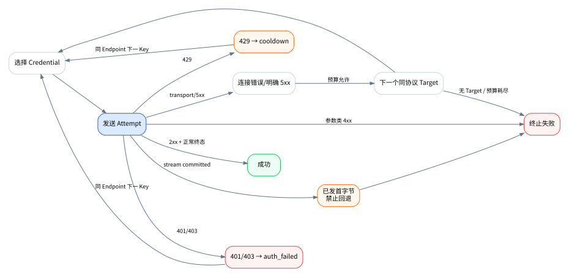
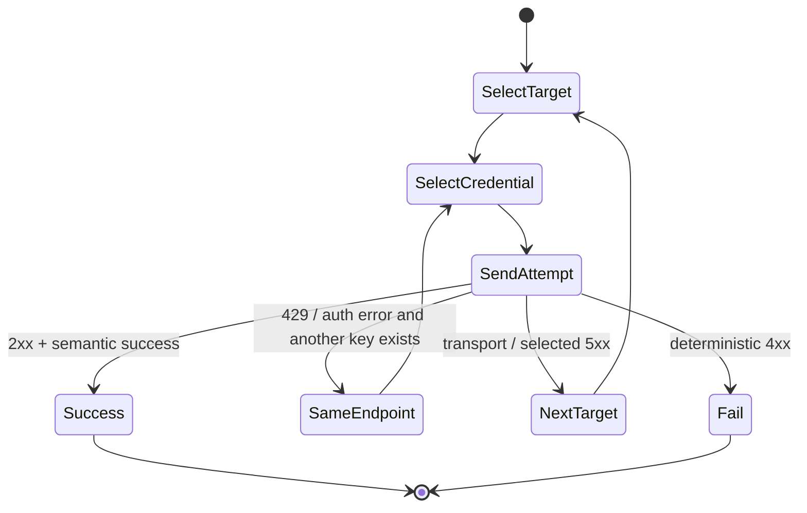

# 路由引擎

## 1. 路由输入与输出

输入：

```text
GatewayClient
HarnessProfile
IngressProtocol
RequestedModel
当前 Route Snapshot
Endpoint/Credential 健康状态
```

输出：

```text
Matched RouteRule
Ordered RouteTargets
Selected Credential for first Attempt
RoutingExplanation
```

请求内容中的图片、音频、工具和其他能力不参与路由选择。

## 2. 路由匹配算法

### 2.1 候选作用域

按顺序收集：

1. `scope_type = client` 且 `scope_id = gateway_client.id`；
2. `scope_type = harness` 且 `scope_id = harness_profile.id`；
3. `scope_type = global`。

### 2.2 协议过滤

只保留 `route.protocol == ingress_protocol`。任何协议不一致目标在配置编译阶段即为错误。

### 2.3 模型匹配类型

优先级：

```text
exact > prefix > glob > regex
```

定义：

- exact：区分大小写的完整相等，除非 Profile 明确声明大小写归一化；
- prefix：`requested_model.startsWith(pattern)`；
- glob：支持 `*` 和 `?`，必须预编译；
- regex：完整正则，保存时编译并限制复杂度。

MVP 默认模型名区分大小写，不擅自规范化 `[1m]`、命名空间或日期后缀。

### 2.4 排序元组

候选规则按以下元组降序排序：

```text
(
  scope_rank,             client=3, harness=2, global=1
  matcher_rank,           exact=4, prefix=3, glob=2, regex=1
  explicit_priority,
  pattern_length,
  -created_at
)
```

第一条为最终 RouteRule。

如果两个规则所有排序维度相同且都匹配，Route Compiler 应标记歧义并拒绝发布新 Snapshot，而不是运行时随机选择。

### 2.5 伪代码

```ts
function resolveRoute(ctx: RouteContext, snapshot: RouteSnapshot): RouteResolution {
  const candidates = snapshot
    .getRules(ctx.clientId, ctx.harnessProfileId, ctx.protocol)
    .filter((rule) => rule.enabled)
    .filter((rule) => rule.matcher.matches(ctx.requestedModel))
    .sort(compareRouteSpecificity)

  if (candidates.length === 0) throw new GatewayNoRouteError(ctx)
  if (isAmbiguous(candidates[0], candidates[1])) throw new GatewayRouteAmbiguousError(ctx)

  return {
    rule: candidates[0],
    targets: snapshot.getEnabledTargets(candidates[0].id),
    explanation: explain(candidates, ctx),
  }
}
```

## 3. RouteTarget 验证

发布 Route Snapshot 前必须满足：

- 至少一个启用目标；
- Target Endpoint 协议等于 RouteRule 协议；
- ProviderModelBinding 属于该 Endpoint；
- Endpoint 未禁用；
- 模型未标记 unavailable；
- RequestPatch 不修改受保护结构；
- `sequence` 连续且唯一；
- `max_attempts_on_target >= 1`；
- 总 Gateway Attempt Budget 不超过全局硬上限。

未验证或部分兼容 Endpoint 可以保存，但 UI 必须要求确认；`blocked` 不允许启用。

## 4. Credential 选择算法

### 4.1 可用集合

排除：

```text
EndpointCredential.enabled = false
ProviderAccount.status = disabled
ProviderCredential.status in [disabled, auth_failed, unavailable]
ProviderCredential.status = cooldown && cooldown_until > now
```

`unverified` Credential 只允许 Probe 或用户显式测试，不参与自动生产路由。

### 4.2 优先级和 Round Robin

1. 找到数值最小的 `EndpointCredential.priority` 可用组；
2. 在同优先级组内按 Round Robin 选择；
3. Weight 在 MVP 固定为 1，保留字段但不实现加权；
4. 选择结果写入 Attempt Snapshot。

### 4.3 账号固定模式

- automatic：使用上述算法；
- pinned_account：仅该 Account 下可用 Credential；
- pinned_credential：仅指定 Credential，失效则该 Target 不可用；
- account_group：未来扩展，MVP 可暂不开放 UI。

## 5. Attempt 与回退状态机





## 6. 错误分类与动作

| 情况 | Credential 动作 | Route 动作 | 是否重试 |
|---|---|---|---|
| DNS/TLS/连接失败 | 不一定降级 | 可下一个 Target | 是 |
| 408/超时，未收到 Body | 可保留 | 可下一个 Target，谨慎 | 是 |
| 429 | 进入 cooldown | 先同 Endpoint 换 Key | 是 |
| 401/403 | 标记 auth_failed | 同 Endpoint 换 Key | 是 |
| 400/422 参数错误 | 不变 | 不回退 | 否 |
| 404 Endpoint 路径错误 | Endpoint unhealthy | 可下一个 Target | 是 |
| 500/502/503/504 | 记录失败 | 可下一个 Target | 是 |
| 已收到上游 Body 后断开 | 不自动重复计费请求 | 不回退 | 否 |
| 已向客户端发首字节 | 不切换 | 不切换 | 否 |
| 客户端取消 | 不惩罚 Provider | 终止 | 否 |

具体状态码策略应可配置，但默认必须保守。

## 7. 429 冷却

冷却时间来源：

1. 解析 `Retry-After`；
2. 解析厂商明确限流 Header；
3. 使用 Endpoint 默认冷却，例如 60 秒；
4. 连续 429 可指数增加，但设最大值。

状态更新：

```text
status = cooldown
cooldown_until = now + duration
last_error_code = upstream_rate_limit
```

到期后不直接标记 healthy，可转为 `unverified` 或在下一次成功时标记 healthy。MVP 可采用“到期重新参与，成功后 healthy”。

## 8. Gateway Attempt Budget

默认：

```text
max_gateway_attempts_per_request = 2
```

硬上限建议 5。RouteTarget 数量、单目标最大尝试和 Credential 数量不能突破总 Budget。

原因：Harness 本身可能已经有重试。Gateway 不知道客户端的外部重试次数，因此内部必须小而保守。

## 9. 流式边界

在客户端收到首字节前：

- 可以因连接失败、429、5xx 切换；
- 每个失败 Attempt 都记录。

在客户端收到首字节后：

- 禁止切换；
- 上游中断直接记录 `stream_interrupted`；
- 保留已经传输的内容；
- 返回连接中断，不拼接另一个模型的输出。

## 10. 路由快照

运行时不应为每次请求执行复杂数据库 Join。Route Compiler 生成不可变 Snapshot：

```text
version
compiled_at
rules_by_client_protocol
rules_by_harness_protocol
global_rules_by_protocol
targets_by_rule
endpoint_summaries
credential_pool_refs
```

发布流程：

```text
读取配置事务快照
→ 校验
→ 编译 matcher
→ 检测歧义
→ 生成版本号
→ 原子替换内存引用
→ 保存发布结果
```

编译失败时继续使用旧版本。

## 11. Explain Routing

每次解析产生机器可读解释：

```json
{
  "requestedModel": "gpt-5.4",
  "protocol": "openai_responses",
  "client": "Codex - Arch",
  "matchedRule": "codex-responses-gpt-5.4",
  "matchReason": {
    "scope": "client",
    "matcher": "exact",
    "priority": 100
  },
  "targets": [
    {
      "sequence": 1,
      "provider": "DeepSeek",
      "endpoint": "Responses",
      "upstreamModel": "deepseek-v4-flash",
      "credentialSelection": "automatic"
    }
  ]
}
```

UI 的路由模拟器调用同一解析代码，禁止维护第二套前端规则。

## 12. 路由验收条件

- 相同输入和 Snapshot 得到相同 RouteRule；
- Client 规则覆盖 Harness 规则；
- Harness 规则覆盖 Global；
- exact 覆盖 glob；
- 协议不一致 RouteTarget 无法发布；
- 歧义规则无法发布；
- 429 可以换 Key；
- 400 不会回退；
- 首字节后不会切换上游；
- Explain 输出与实际 Attempt 一致。
