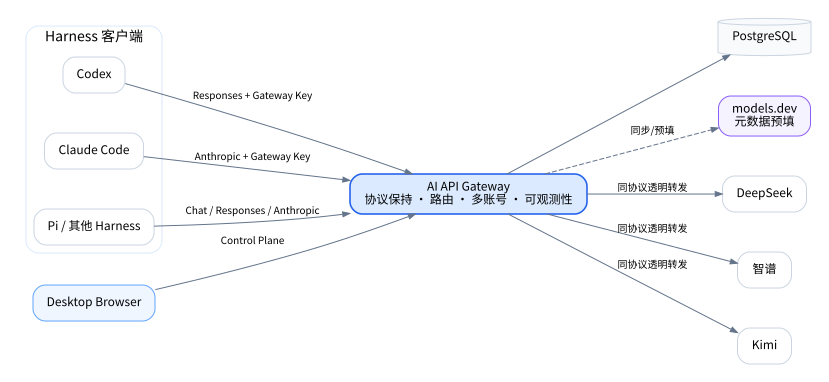
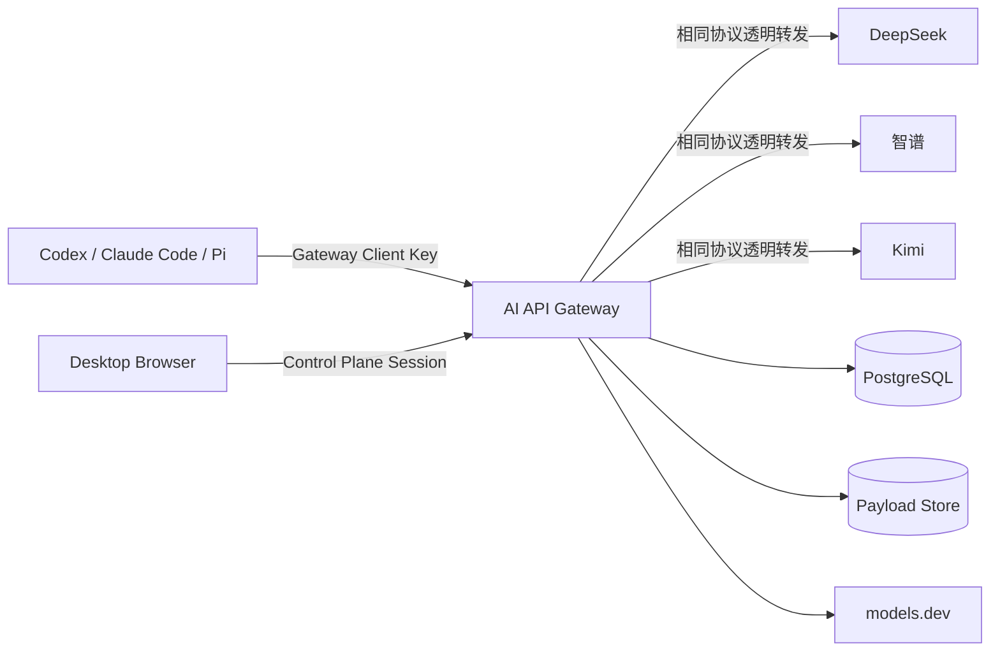

# 系统架构

## 1. 系统上下文





## 2. 架构结论

MVP 使用**模块化单体**：一个 Node.js 24 进程、一个 PostgreSQL、两个逻辑平面和一个静态 Web 控制面。

```text
┌──────────────────────────────────────────────────────────────┐
│ AI API Gateway Process                                       │
│                                                              │
│  Data Plane                                                  │
│  ├── Ingress Router                                          │
│  ├── Gateway Client Authentication                           │
│  ├── Protocol Adapter                                        │
│  ├── Immutable Routing Snapshot                              │
│  ├── Credential Scheduler                                    │
│  ├── Undici Transport Pools                                  │
│  ├── Bounded Observer Tap                                    │
│  └── Request / Attempt Recorder                              │
│                                                              │
│  Control Plane                                               │
│  ├── Better Auth Session                                     │
│  ├── OpenAPI Admin API                                       │
│  ├── Provider / Model / Route / Client Management            │
│  ├── Snapshot Compiler and Publisher                         │
│  ├── Request / Analytics Query                               │
│  ├── Probe / models.dev / Aggregation Jobs                   │
│  └── Backup / Retention Commands                             │
│                                                              │
│  Web                                                         │
│  └── React + Vite static assets                              │
└──────────────────────────────────────────────────────────────┘
                 │                    │
                 ▼                    ▼
             PostgreSQL         Local PayloadStore
```

部署上保持简单；代码上必须严格分离数据面和控制面。完整技术栈见 [工程基础与技术栈](engineering-foundation.md)。

## 3. 推荐部署拓扑

```text
Browser ───────────────┐
                       │
Harness ── HTTPS ──> Reverse Proxy ──> Gateway App ──> Providers
                                         │      │
                                         │      └────> Payload directory
                                         └───────────> PostgreSQL
```

MVP 可以省略独立 Reverse Proxy，由 Gateway 直接监听端口。公开部署建议使用 Caddy、Nginx 或 Traefik 终止 TLS。

## 4. 请求关键路径

```text
Ingress
→ identify protocol/path
→ authenticate Gateway Client Key
→ spool/minimally inspect request body
→ resolve route from immutable snapshot
→ choose credential
→ create Request/Attempt metadata
→ dispatch through Undici Pool
→ stream upstream bytes to client
→ non-blocking bounded observation
→ finalize Attempt and Request
```

关键路径不访问控制面配置表，不等待 Analytics 聚合，不依赖 models.dev，也不把完整流积累到内存。

## 5. 数据面模块

### 5.1 Ingress Router

- 根据路径识别 `IngressProtocol` 和 `HarnessProfile`；
- 限制方法和 Content-Type；
- 生成 `gateway_request_id`；
- 将请求交给 Gateway Client Authentication；
- 不负责模型选择、上游 URL 和跨协议转换。

### 5.2 Client Authentication

- 从 `Authorization: Bearer` 或 `x-api-key` 读取 Gateway Client Key；
- 使用 Hash/HMAC 和常量时间比较；
- 解析 `GatewayClient` 与 `HarnessProfile`；
- 校验协议、状态、过期时间和限额；
- 删除客户端认证 Header，禁止透传。

### 5.3 Protocol Adapter

- 最小提取 `model`、`stream` 和 Gateway 允许修改的字段；
- 保持未知 JSON 字段；
- 生成上游请求 URL、Header、Query 和 Body；
- 为 Gateway 自有错误使用入口协议最小兼容表示；
- 不把 Chat、Responses 和 Anthropic 转换为统一内部 DTO。

### 5.4 Route Resolver

- 只读取已编译 `RoutingSnapshot`；
- 使用 Client/Harness/Global 和 Matcher 优先级进行确定性匹配；
- 输出 Rule、Target 候选、模型映射和解释；
- 拒绝协议不一致目标；
- 纯函数，不访问数据库、网络或隐式时间。

### 5.5 Credential Scheduler

- 从 RouteTarget 的 EndpointCredential 集合选择可用 Credential；
- 处理优先级、Round Robin、冷却、禁用和鉴权失败；
- 接收显式 `now` 和状态快照；
- 为每次 Attempt 生成可审计但不含明文 Secret 的选择快照。

### 5.6 Upstream Transport

使用 Undici `Pool`/`Dispatcher`：

- 一个 origin 一个有限连接池，不按 Credential 建 Pool；
- 显式 Abort、Connect/Header/Chunk Idle Timeout；
- 禁止底层自动重试，由 Gateway 决策层控制；
- 支持原始 Header 和流式 Body；
- Redirect、代理和 TLS 必须受控。

### 5.7 Bounded Observer Tap

```text
Upstream chunk
├── Main path：await downstream write，遵守背压
└── Observer path：try enqueue 到有限队列
                   ├── 成功：解析 Usage / TTFT / Error
                   └── 满载：observation_incomplete，不阻塞主路径
```

禁止使用 `Response.clone()`、`ReadableStream.tee()` 或 `streamSSE()` 作为透明流实现。Observer 抛错、变慢或达到上限时，只允许降级观测。

### 5.8 Recorder

- 先创建 Request，再为每次上游调用创建 Attempt；
- 流式请求不持有长事务；
- Attempt 完成后用短事务写 Usage、PricingSnapshot 和状态；
- Request 最终汇总所有 Attempt；
- Recorder 写入失败不能篡改已发送给客户端的协议响应，但必须记录内部故障和最小恢复信息。

## 6. 控制面模块

### 6.1 Admin API

严格 JSON/OpenAPI 契约：

```text
createRoute
→ typed handler
→ service
→ Drizzle/PostgreSQL
→ admin-openapi.json
→ generated Web client
```

Control Plane Route 模式不得套到透明数据面。详见 [HTTP 契约与路由定义](../conventions/http-contracts-and-route-definition.md)。

### 6.2 Provider Management

管理 Provider、Endpoint、Account、Credential、EndpointCredential、Probe 和健康状态。

### 6.3 Model Registry

管理 ModelDefinition、ProviderModelBinding、models.dev Snapshot、字段来源、价格和本地覆盖。

### 6.4 Snapshot Compiler

把数据库 RouteRule 编译为内存只读 Snapshot：

- 验证所有引用和协议；
- 预编译 Glob/Regex；
- 检测歧义；
- 建立 Client/Harness/Global 索引；
- 编译成功后原子替换运行时引用；
- 失败时继续使用上一个有效 Snapshot。

配置保存与运行时发布是两个显式状态。UI 必须区分 Draft、Saved、Published 和 Publish Failed。

### 6.5 Analytics

Request 和 Attempt 是不同事实表。MVP 使用 PostgreSQL 明细和小时/天聚合表，不引入 ClickHouse。

### 6.6 Background Jobs

- models.dev 同步；
- Provider 模型发现；
- Endpoint/Credential Probe；
- 日志和 Payload 保留清理；
- 冷却状态恢复；
- 小时/天聚合；
- 备份提醒。

Job 失败不能停止数据面；同一任务必须通过耐久原子 Claim 防止重入，跨多项资源的互斥任务再使用 Advisory Lock。

Endpoint 完整兼容性 Probe 使用专用 Application-owned Runner，不建立通用 Job 框架。Run 先持久化再进入进程内队列；PostgreSQL 以活跃目标唯一索引合并重复任务，并以原子状态 Claim 确认唯一执行者。Runner 在关闭时中止并等待拥有的上游请求，之后才能关闭 Undici Pool 和数据库。

## 7. Application Composition 与生命周期

```text
createApplication(dependencies)
  只创建 Hono App 和显式 Route 组合

lifecycle
  创建 DB/Undici/PayloadStore/Scheduler
  启动 Server
  处理 Signal
  执行 Graceful Shutdown
```

模块 Import 不得启动 Server、Timer、Pool 或数据库连接。关闭顺序：

```text
停止接受新请求
→ drain in-flight 或达到 deadline
→ 停止 Observer/Recorder 新任务并 drain
→ 停止 Scheduler
→ 关闭 Undici Pools
→ 关闭 PostgreSQL Pool
```

## 8. 推荐代码模块

完整仓库结构和依赖门禁见 [仓库结构与依赖边界](repository-layout-and-dependency-boundaries.md)。核心轮廓：

```text
apps/gateway/src/
├── app/
├── control-plane/
├── data-plane/
├── catalogs/
├── commands/
├── config/
├── core/
└── db/

apps/web/src/
├── app/
├── routes/
├── features/
├── components/
├── api/
└── lib/
```

## 9. 可用性与退化策略

- models.dev 不可用：使用最后一次 Snapshot 和本地覆盖；
- Probe 不可用：现有 Endpoint 保持原状态，标记证据过期；
- Analytics 聚合失败：Request/Attempt 明细继续写入；
- PayloadStore 失败：保留最小元数据并标记 Payload 不完整；
- Snapshot 编译失败：继续使用上一个有效版本；
- Control UI 不可用：Data Plane 继续运行；
- PostgreSQL 完全不可用：MVP 默认 fail closed；任何短时离线模式必须由新 Decision Note 定义。

## 10. 性能与资源边界

- 小型 JSON Request 可内存缓冲，大型请求写私有临时 Spool；
- SSE 不累计完整响应；
- Observer、Payload、Error Body、Header 和日志字段均有字节/条目上限；
- Dashboard 查询聚合表，不扫描 Raw Payload；
- Route Snapshot 在内存匹配；
- Credential Round Robin 可以保存在单进程内存，持久状态写 PostgreSQL；
- 数据面性能测试必须记录 TTFT overhead、CPU、RSS、Event Loop Lag、DB Write Latency 和 Observer Drop。
