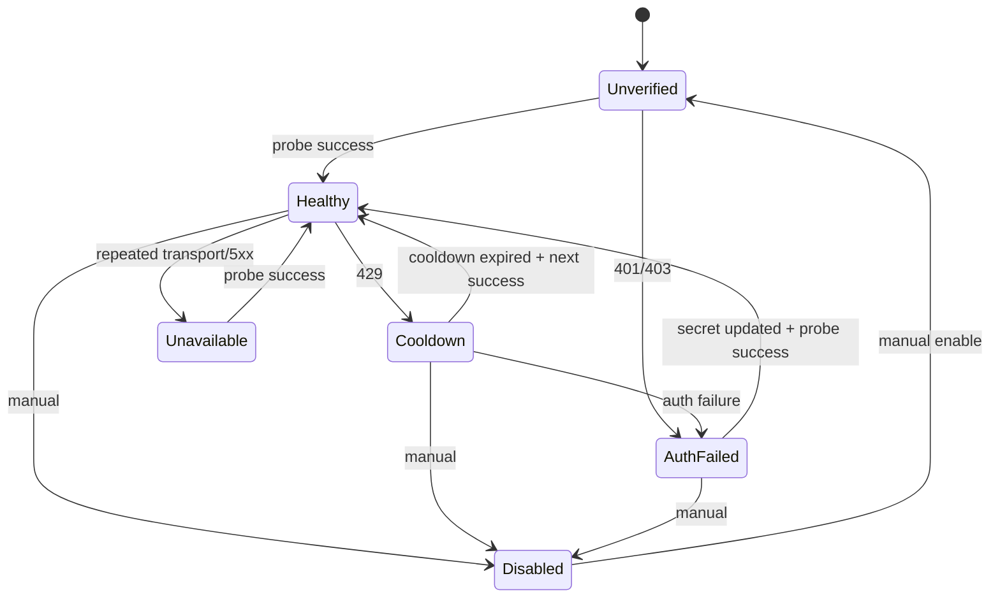

# Provider、Endpoint 与多账号设计

## 1. 为什么必须拆分

错误建模：

```text
Provider = Base URL + API Key
```

无法表达：

- 同一厂商多个协议入口；
- 同一厂商普通 API 与 Coding Plan 专属 Endpoint；
- 同一账号多个 API Key；
- 同一个 Key 可用于多个 Endpoint；
- 每个 Key 独立健康状态；
- 账号采用包月而非按 Token 计费。

正确结构：

```text
Provider
├── UpstreamEndpoint
└── ProviderAccount
    └── ProviderCredential

UpstreamEndpoint ← EndpointCredential → ProviderCredential
```

## 2. Provider 预设

内置预设只提供“初始建议”，不是永久硬编码：

- 厂商名称与图标；
- 常见 Endpoint Base URL 和路径；
- 鉴权方式；
- 支持的协议声明；
- models.dev Provider ID 候选；
- 文档链接；
- Probe 模板；
- 已知兼容性提示。

用户可以复制为自定义 Provider，但内置预设升级时不得覆盖用户修改。

## 3. Endpoint 配置

每个 Endpoint 必须明确：

```text
协议
Base URL
Request Path
Models Path（可选）
鉴权方式
流式支持
超时
Header / Query 默认值
Harness Compatibility
```

不允许用一个 `supports_responses: true` 概括整个 Provider。兼容性是 Endpoint + HarnessProfile 维度。

## 4. 账号和套餐

ProviderAccount 用于费用归因：

```text
DeepSeek 主账号        metered
智谱 Coding Plan       subscription
Kimi 测试账号          free
自定义中转             custom
```

Account 级字段可以保存：

- 套餐名称；
- 月度固定成本；
- 账期开始日；
- 额度说明；
- 账号标签；
- 费用归因模式。

MVP 不需要自动登录厂商后台获取账单。

## 5. Credential 生命周期

### 5.1 创建

1. UI 收集 Secret；
2. 服务端验证格式和重复 Fingerprint；
3. 使用主密钥加密；
4. 保存 Mask；
5. 状态设为 `unverified`；
6. 用户执行测试；
7. 成功后设为 `healthy`。

### 5.2 轮换

推荐流程：

```text
添加新 Key
→ 测试成功
→ 新 Key 加入同优先级池
→ 观察
→ 禁用旧 Key
→ 删除旧 Secret 或保留短期回滚
```

客户端无需修改 Gateway Key。

### 5.3 撤销

撤销后：

- 不再参与选择；
- 历史 Attempt 保留 Fingerprint/Mask 快照；
- 不保留明文；
- UI 显示撤销时间和最近使用时间。

## 6. Credential 状态机



## 7. 健康度

MVP 不实现复杂综合评分。选择只依据：

- enabled；
- priority；
- status；
- cooldown_until；
- Round Robin。

UI 可以显示最近 24 小时：

- Attempt 数；
- 成功率；
- 429 率；
- P95 TTFT；
- 最近成功；
- 最近错误。

这些指标不自动改变 Credential 优先级，避免不可解释行为。

## 8. Circuit Breaker

Endpoint 级轻量 Circuit Breaker：

```text
closed
→ 连续 N 次 transport/5xx
open（短时不选）
→ cooldown 后 half_open
→ Probe 或真实请求成功后 closed
```

429 主要影响 Credential，不应默认打开整个 Endpoint，因为其他账号可能仍有额度。

推荐初始参数：

```text
consecutive_failures_to_open = 5
open_duration = 30s
half_open_max_attempts = 1
```

作为配置默认值，不是固定常量。

## 9. Provider Probe

Probe 分为：

### 9.1 Credential Probe

- 最小非流式请求；
- 验证鉴权；
- 使用指定低成本模型；
- 不自动循环所有模型。

### 9.2 Endpoint Probe

- 非流式基本请求；
- SSE 基本请求；
- Tool Call；
- Usage；
- Reasoning 参数；
- 结构化输出；
- 错误 Envelope。

### 9.3 Harness Probe

Codex：

- Responses SSE；
- Function Tool；
- `apply_patch`（若目标声称支持）；
- Reasoning Event；
- `/models` 目录兼容。

Claude Code：

- Anthropic Message；
- Tool Use/Result；
- Thinking；
- 多个 Claude 模型别名；
- 流式消息终态。

Probe 必须显式触发或受控定时，避免无意产生大量费用。

## 10. 多 Key 统计

每个 Attempt 保存：

```text
provider_id
endpoint_id
account_id
credential_id
credential_mask_snapshot
```

UI 默认按账号聚合，可下钻到 Credential。不要在 Dashboard 直接显示完整 Key 或过多 Key 级图表。

## 11. UI 映射

数据库实体在 UI 中组织为“连接”：

```text
连接详情
├── 概览
├── 接口
├── 账号
├── 模型
├── 兼容性
└── 高级设置
```

用户添加 API Key 时先选择账号；默认可在一个步骤中同时创建 Account + Credential，避免暴露底层复杂度。

## 12. 验收条件

- 一个 Provider 能配置三个不同协议 Endpoint；
- 一个 Account 能配置多个 Credential；
- 一个 Credential 能绑定多个 Endpoint；
- Coding Plan Key 可限制到专属 Endpoint；
- 429 只冷却当前 Credential；
- 401/403 不会永久污染整个 Provider；
- Credential Secret 不出现在日志、错误和导出；
- UI 能查看每个账号和 Key 的健康状态与使用量。

## 13. 当前实现边界

控制面把 Provider、默认 Endpoint、Account、Credential 与 EndpointCredential 作为一次原子创建；`addConnectionEndpoint` 可在现有 Provider 下原子创建额外协议 Endpoint，并只绑定同一 Provider 下未禁用的 Credential。列表和详情返回聚合视图，只包含 Credential Mask、状态和绑定 Endpoint。Provider Secret 以 AES-256-GCM 密文持久化，轮换替换同一 Credential 的密文并恢复为 `unverified`，禁用后不再参与数据面解析。

`probeProviderCredential` 必须由用户显式提交 Endpoint 和真实模型 ID，并在界面说明可能产生费用。它发送一次最小非流式请求，区分成功、鉴权失败、限流、上游拒绝和不可用，只持久化安全状态与成功/失败时间。

`probeEndpoint` 是独立的完整兼容性任务。控制面先返回耐久 Run，再由 Application-owned Runner 顺序测试鉴权与基础请求、SSE、Usage、未知字段、Tool Call、Reasoning、结构化输出、错误 Envelope 和协议对应的 Harness 组合能力。鉴权与基础请求共用一次上游调用；401/403 会停止后续网络请求，并把未执行项明确记录为 `unknown`。同一 Endpoint、Credential 和模型的活跃任务被合并，避免重复计费。

CompatibilityProfile 绑定 Endpoint 与 Harness Profile；CompatibilityFact 同时记录实测模型、支持等级、时间、Run 引用和脱敏结论。Run 的 `succeeded` 只表示套件执行完成；能力差异由 `verified`、`partial`、`blocked` 及 Fact 支持等级表达。结果不保存原始上游 Body、Header 或完整 Credential，也不参与运行时自动选模。

`discoverUpstreamModels` 使用指定 Endpoint 及其已绑定、未禁用的 Credential 请求显式模型目录路径，只接受 OpenAI-compatible `data[].id`。完整 Secret 只在 Gateway 内解密；响应大小受限，失败映射为稳定控制面错误，不保存原始目录或创建后台任务。

当前不执行定时 Probe、厂商私有模型目录解析、模型别名穷举、429 冷却或多 Credential 调度。

PostgreSQL 启动时只在 `BOOTSTRAP_PROVIDER_CREDENTIAL_ID` 不存在时，把环境变量 Secret 加密后创建 Bootstrap Provider、Account 和 Credential。已有 Credential 的密文、状态和轮换结果不会被启动配置覆盖；Bootstrap Endpoint 仍由静态 `RoutingSnapshot` 的环境变量拥有，等待动态 Snapshot 切片接管。
