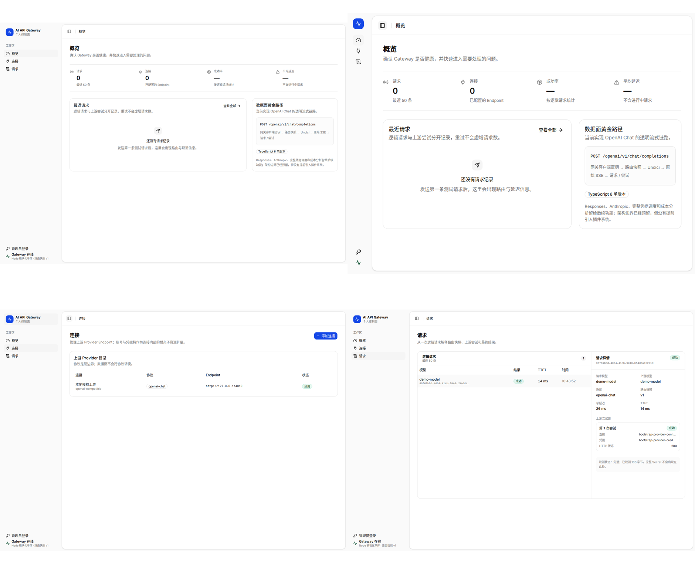

# App Shell 与视觉系统

## 1. 视觉方向

整体采用官方 shadcn `base-nova + Blue + Inter` 语义主题，通过精确密度、开放式布局、状态色和信息结构形成现代产品感。视觉应接近专业开发者工具，而不是通用后台模板。

必须遵守：

- Light 使用白色内容表面和浅色 Sidebar；Dark 使用中性深色表面与清晰边框，不使用大面积纯黑；
- 蓝色主操作；
- 彩色只承载状态和对象识别；
- 1px 边框和极轻阴影；
- 小半径；
- 表格、分栏、开放式 KPI 优先；
- 不使用渐变、玻璃、发光、超大圆角、装饰性彩色卡片、无意义徽章墙。



## 2. Shell 结构

```text
┌──────────────── Sidebar（浮动 inset） ────────────────┐
│ Brand                                                   │
│ Monitoring / Configuration / System navigation          │
│ System health footer                                    │
└─────────────────────────────────────────────────────────┘

  ┌──────────────── Main Surface（独立白色表面） ───────┐
  │ Topbar：Sidebar Trigger / Current Page / Theme        │
  ├───────────────────────────────────────────────────────┤
  │ Page Scroll                                           │
  │ Page Header                                           │
  │ Page Content                                          │
  └───────────────────────────────────────────────────────┘
```

App Shell 由官方 `SidebarProvider`、`Sidebar variant="inset" collapsible="icon"` 和 `SidebarInset` 组成。Sidebar 与 Inset 使用当前主题的独立语义表面，外边距 8px。页面内部不得继续层层套大圆角容器。

Sidebar 展开状态为 16rem，图标状态为 3rem。官方 Provider 拥有交互状态，使用非敏感 `sidebar_state` Cookie 跨刷新恢复，并支持顶部中文 Trigger、侧栏 Rail 和 `Cmd/Ctrl+B`。折叠导航必须显示中文 Tooltip。`SidebarInset` 顶部固定保留 56px Topbar，显示中文折叠按钮、当前页面标题和 Theme Dropdown Menu。

Theme 偏好固定为 `system | light | dark`，默认 `system`，使用非敏感 `aigw_theme` Local Storage 值跨刷新恢复。`system` 实时跟随系统配色变化，显式 Light/Dark 不受系统变化覆盖；同源标签页通过 `storage` 事件同步。React 挂载前的同步 Bootstrap 与 Theme Provider 使用同一输入输出合同，并同步根 Class、`color-scheme` 和 `theme-color`，避免首屏闪烁。

## 3. 尺寸 Token

| Token | 值 | 用途 |
| --- | ---: | --- |
| `--sidebar-width` | 256px（16rem） | 官方展开侧栏 |
| `--sidebar-width-icon` | 48px（3rem） | 官方图标侧栏 |
| `--topbar-height` | 56px | 全局顶栏 |
| `--page-gutter` | 24px | 1440px 基准页边距 |
| compact gutter | 20px / 16px | 1440px 以下 / 1280px 以下 |
| `--radius` | 10px | Card、主面板、编辑分区 |
| `--radius-sm` | 6px | Button、Input、Select |
| shell radius | 12px | Sidebar 与 Main Surface |
| default control height | 34px | Button、Input、Select |
| small control height | 30px | Toolbar、次级动作 |
| table row | 42px | 默认数据行 |
| table header | 35px | 表头 |
| page top padding | 22px | 普通页面 |

这些值由 [`design-tokens.json`](design-tokens.json) 锁定。Feature 代码不得复制硬编码值。

## 4. 颜色 Token

### 4.1 基础色

| 语义 | 值 |
| --- | --- |
| Sidebar | `#fafafa` |
| 内容表面 | `#ffffff` |
| 主文字 | `#0a0a0a` |
| Primary | `#1447e6` |
| Primary foreground | `#eff6ff` |
| 次级文字 | `#737373` |
| 边框 / 输入框 | `#e5e5e5` |
| 轻背景 | `#f5f5f5` |
| Focus ring | `#1447e6` |

### 4.2 状态色

| 状态 | 前景 | 软背景 | 边框 |
| --- | --- | --- | --- |
| Success | `#004726` | `--success / 10%` | `--success / 20%` |
| Warning | `#743800` | `--warning / 10%` | `--warning / 20%` |
| Danger | 官方 `destructive` | 官方 `destructive / 10%` | 透明 |
| Info | `#1d4ed8` | `#eff6ff` | `#bfdbfe` |
| Purple object accent | `#7e22ce` | `#faf5ff` | `#e9d5ff` |

状态色只能用于 Badge、Alert、状态图标、轻量对象标识和必要的趋势提示。大面积布局仍保持中性。

Dark 的完整表面、文字、边框、Focus 与状态色以 [`design-tokens.json`](design-tokens.json) 的 `darkColor` 为唯一机器可读来源。Feature 只消费语义 Token，不使用散落的 `dark:` 原始色补丁。

## 5. Typography

字体栈：

```text
Inter Variable, PingFang SC, Hiragino Sans GB, Microsoft YaHei, Noto Sans CJK SC, ui-sans-serif, system-ui, sans-serif
```

| 层级 | 字号 / 行高 | 字重 | 用途 |
| --- | --- | --- | --- |
| Page title | 22 / 30 | 680 | 页面一级标题 |
| Editor title | 18 / 26 | 670 | 路由编辑页 |
| Entity title | 16 / 23 | 660 | 连接详情、设置分区 |
| Card title | 13 / 19 | 650 | 区块标题 |
| Body | 12–14 / 18–21 | 400–560 | 表格、说明、控件 |
| Helper | 12 / 18 | 400–560 | 辅助信息、表头、描述 |
| Monospace | 12–13 | 500–650 | ID、模型名、URL、Key Mask |

页面标题和主要数值使用负字距与 tabular numerals。不能把整页设置成等宽字体。

常驻中文正文、Label 和表头不得小于 12px。10px 只用于非关键、短且有充足上下文的微型元数据。

## 6. 阴影、边框和层级

- 普通页面表面：1px 边框 + `shadow-xs`；
- Card：1px 边框 + `shadow-xs`；
- Dropdown/Popover：边框 + `shadow-sm`；
- Dialog：仅浮层使用明显阴影；
- Sheet：使用方向性阴影；
- 选中表格行：背景变化 + 左侧 2px 内嵌标识，不使用发光描边。

页面内的视觉层级主要靠边框、背景、留白、排版和布局建立，不依赖阴影堆叠。

## 7. 图标

统一使用 `components.json` 指定的图标库，当前设计为 Lucide 风格：

- 线性、圆角端点、统一描边；
- 导航与控件图标默认 15–16px；
- Provider 标识可使用字母 Mark 或品牌图标，但不得与操作图标混淆；
- 纯图标按钮必须有可访问名称和 Tooltip；
- 状态不能只靠图标表达，必须有文字或 Badge。

## 8. 密度规则

- 页面默认是中等偏紧凑密度；
- 一屏应能看到主任务和足够上下文；
- 不为追求“留白感”牺牲比较效率；
- 不把每个指标做成独立大卡片；
- 不把表格转换为卡片列表；
- Card 只用于形成真正的任务区块，不作为所有内容的默认容器。
