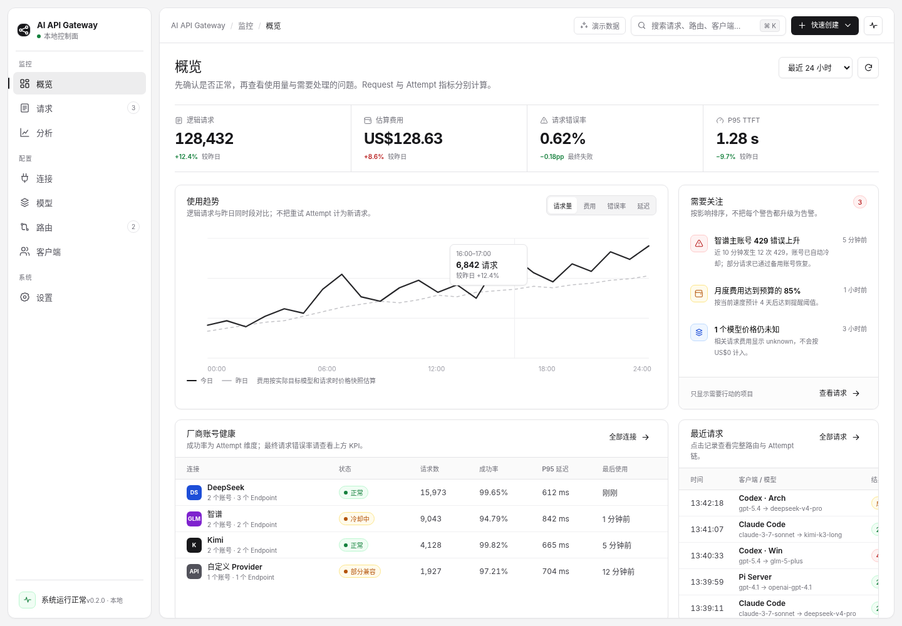

# 概览页



## 1. 页面目标

概览只回答三件事：

1. 系统是否正常；
2. 当前使用量、费用、最终错误率和 TTFT 如何；
3. 哪些问题需要用户行动。

它不是所有指标的缩略版，也不是彩色卡片大屏。

## 2. 页面结构

```text
Page Header + 时间范围 / 刷新
开放式 KPI Strip（4 项）
主趋势图 ┃ 需要关注
厂商账号健康 ┃ 最近请求
```

### 2.1 KPI Strip

固定四项：

- 逻辑请求；
- 估算费用；
- 最终请求错误率；
- P95 TTFT。

KPI 使用开放式分栏，不放入四张独立 Card。每项包含 Label、主值、与上期差异和口径说明。

语义要求：

- 请求数按 `Request` 计数；
- 费用按实际上游模型与 Attempt 发生时价格快照估算；
- 错误率为最终失败 Request 比例；
- TTFT 从 Gateway 接收请求到上游首字节。

### 2.2 主趋势

默认展示逻辑请求趋势，并允许切换：请求量、费用、错误率、延迟。当前周期使用实线，对比周期使用弱虚线。费用图必须注明来源与 unknown 处理。

### 2.3 需要关注

只显示需要行动或判断的事项，按影响排序。每项必须包含：

- 发生了什么；
- 影响；
- 时间；
- 点击后的目标页面。

示例：

- 账号 429 上升 → 请求或连接账号；
- 预算接近阈值 → 分析；
- 模型价格未知 → 模型详情。

普通成功、同步完成等不进入此列表。

### 2.4 厂商账号健康

紧凑表格展示连接、状态、请求数、Attempt 成功率、P95 延迟、最后使用。点击行进入对应连接详情。

必须在标题说明：这里的成功率是 Attempt 维度，不能与上方 Request 错误率混淆。

### 2.5 最近请求

展示最近 5–10 个逻辑请求。至少包括时间、客户端/请求模型、实际目标、最终结果和费用。点击行进入请求页并定位记录。

## 3. 交互

- 时间范围：24h / 7d / 30d；
- 刷新：显示局部 loading，不清空已有数据；
- 图表指标切换：不改变其他区块；
- Attention item：带上下文跳转；
- 表格行：进入对应详情。

## 4. 状态

- 没有请求时：KPI 显示 0，但费用未知不能显示为 0；趋势区显示首次使用引导；
- 部分聚合失败：保留其他区块，并在失败区块显示重试；
- 价格有 unknown：总费用旁显示“另有 N 个模型价格未知”；
- 系统级故障：在页面顶部出现高优先级 Banner，不能只放在侧栏 Footer。
