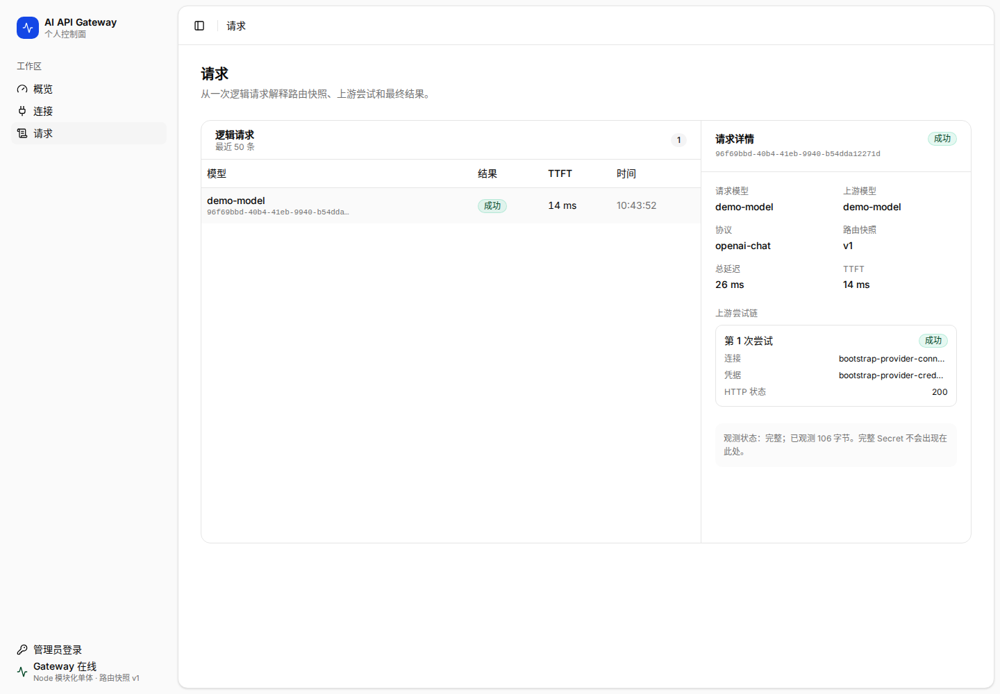

# 请求排障页



## 1. 页面目标

请求页是核心排障工作台。用户应在不阅读服务器日志的情况下理解一次逻辑请求的完整生命周期。

## 2. Master–Detail 结构

```text
Page Header
Filter Toolbar
┌────────────── Request Master Table ─────────────┬──────── Inspector ────────┐
│ 每行 = 一个逻辑 Request                         │ 结果、根因、Attempt、路由 │
└─────────────────────────────────────────────────┴───────────────────────────┘
```

`1440px` 及以上视口中，左侧至少 620px，右侧至少 390px。`1280px` 和 `1024px` 视口按 Master、Inspector 的 DOM 顺序改为上下布局。两种布局共用一个边框容器，避免两个独立浮动 Card 造成割裂。

## 3. 筛选

默认筛选：

- 搜索：Request ID、客户端、请求模型、实际目标、Provider；
- 最终结果：全部 / 最终成功 / 发生回退 / 最终失败；
- 客户端；
- 协议；
- 时间范围。

筛选应进入 URL。存在筛选时显示“清除”。结果数始终可见。

## 4. Request 表格

每行代表一个逻辑 Request。核心列：

| 列 | 说明 |
| --- | --- |
| 时间 | 相对或本地时间，Hover 显示绝对时间 |
| 客户端 / 请求模型 | Client + 协议 + requested model |
| 实际目标 | Provider Mark + upstream model + 最终账号 |
| 结果 | 200、200·回退、429 等最终状态 |
| TTFT | 最终成功 Attempt 的首字节时间 |
| Token | 归一化 Usage；未知则显示 unknown |
| 费用 | PricingSnapshot；未知不显示 US$0 |

选中行使用中性背景和左侧 2px 标识。切换行时 Inspector 回到“概览”Tab。

## 5. Inspector 信息顺序

Inspector Header 显示 Request ID、时间、最终状态，以及复制、导出诊断和更多操作。

Tabs 固定为：

1. 概览；
2. Attempts N；
3. 路由；
4. 时间线；
5. 请求 / 响应。

### 5.1 概览

第一屏必须先回答结果，而不是先列字段：

- 请求成功；
- 最终成功但使用备用账号；
- 最终失败。

随后展示：客户端、入口协议、请求模型、实际目标、最终账号、命中路由、TTFT/总耗时、Token、费用快照。

最后给出下一步建议，并直接链接到账号健康、路由策略或添加备用目标。

### 5.2 Attempts

显示每个真实上游调用，包含：

- 序号；
- Provider / Endpoint / Account / Credential Mask；
- 开始与耗时；
- HTTP 状态与错误分类；
- 是否触发冷却、鉴权失败、Credential 切换或 RouteTarget 回退；
- 是否产生首字节与 Usage。

顶部必须解释：“Attempt 是上游调用事实；一个 Request 可有多个 Attempt。”

### 5.3 路由

展示匹配解释：

```text
客户端专属 > Harness 专属 > 全局
精确 > 前缀 > Glob > 正则
优先级 > 模式长度 > 创建时间
```

明确列出命中的规则、被跳过的层级、目标链和协议约束。不能只展示最终模型。

### 5.4 时间线

按时间排序显示：

- 接收请求与验证 Client Key；
- 路由匹配；
- Credential 选择；
- 每个 Attempt；
- 错误与冷却；
- 收到首字节；
- 流结束或最终错误；
- Usage / PricingSnapshot 落库。

### 5.5 请求 / 响应

受隐私模式控制：

- `full`：显示完整但脱敏后的正文；
- `truncated`：显示截断正文；
- `metadata_only`：只显示请求摘要、Header 摘要和 Gateway 修改；
- `disabled`：明确说明未持久化。

必须突出 Gateway 的最小修改：模型 ID、Authorization、有限 Header/Query/Body Patch。未知字段、`messages`、`input`、`tools` 的处理必须可解释。

## 6. 页面动作

- 导出：按当前筛选导出脱敏聚合或诊断；
- 发送测试请求：创建一条真实或受控测试 Request，并定位到列表顶部；
- 列设置：控制次要列，不允许隐藏结果、客户端和实际目标；
- 复制 Request ID；
- 导出诊断包。

## 7. 空与错误状态

- 首次为空：引导创建连接、路由、客户端并发送测试请求；
- 筛选为空：保留筛选栏，提供清除；
- Request List 首次失败：只在 Master 区域显示持久错误和重试，不显示成功空状态；
- Inspector 首次失败：只替换 Inspector，保留仍可操作的 Request List；
- 后台刷新失败：保留最后一次成功数据，在对应区域显示非阻断警告和重试；
- Inspector 数据部分失败：保留 Request 摘要，对失败 Tab 显示重试；
- Payload 未保存：不视为错误，而是隐私策略状态；
- 流中断：最终状态与 Attempt 状态都必须显示，不能只显示 HTTP 200。

## 8. 当前交付

当前页面交付最近 50 条逻辑 Request、`requestId` URL 选中状态、上下排列或桌面双栏的 Master–Detail、请求事实、观测完整度和真实 Attempt 列表。Inspector 顶部根据最终状态、Attempt 结果与 HTTP 状态生成保守诊断；没有失败 Attempt 时不宣称发生故障，缺少可分类 HTTP 状态时不推断为超时。

鉴权、限流、5xx 和未分类失败的连接管理入口携带对应 `connectionId`，模型 404 导航到模型页。筛选、详情 Tabs、路由匹配解释、时间线、Payload 和诊断导出仍属于后续交付。
