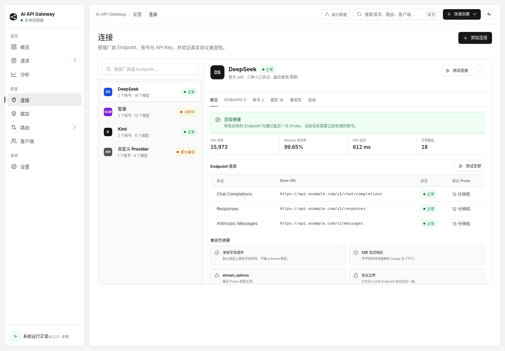

# 连接页



## 1. 页面目标

连接页按 Provider 组织 Endpoint、账号、Credential、模型和兼容性。用户应先判断厂商是否可用，再进入具体配置。

## 2. Provider 目录 + 耐久详情

```text
┌──── Provider Directory ────┬──────────── Provider Detail ─────────────┐
│ 搜索                        │ Header：名称、状态、测试、更多            │
│ Provider 列表               │ Tabs：概览 / Endpoints / 账号 / 模型... │
│ 状态与账号/模型数量         │ 当前 Tab 的耐久内容                       │
└─────────────────────────────┴──────────────────────────────────────────┘
```

左侧目录约 300px；右侧详情填满剩余空间。Provider 切换不离开页面，详情 Tab 保持在 URL 中。

## 3. Provider 列表

每项包含：

- Provider Mark；
- 名称；
- 账号数与模型数；
- 汇总状态。

汇总状态规则：

- 所有启用 Endpoint 正常且至少有可用 Credential → 正常；
- 存在冷却，但仍有可用 Credential → 冷却中；
- 部分 Endpoint 或字段不兼容 → 部分兼容；
- 无可用 Credential 或所有 Endpoint 失败 → 不可用；
- 从未 Probe → 未验证。

## 4. 详情 Header

显示 Provider 名称、类型、Endpoint 数、最近使用和状态。右侧操作：

- 测试连接；
- 更多菜单。

“添加账号”是页面主操作，位于 Page Header；具体 Provider 上下文中也可在账号 Tab 提供次级入口。

## 5. Tabs

### 5.1 概览

- 顶部健康 Alert；
- 24h 请求、Attempt 成功率、P95 延迟、可用模型；
- Endpoint 健康表；
- 兼容性摘要。

### 5.2 Endpoints

每个 Endpoint 显示协议、Base URL、状态、最近 Probe、支持的传输、字段兼容性和测试动作。不同协议 Endpoint 必须分开，不能只展示一个通用 Base URL。

### 5.3 账号

显示 Account 与 Credential：优先级组、Masked Key、状态、冷却剩余、最近错误、最后使用、测试与禁用。

添加账号使用 Sheet：

- 账号名称；
- API Key；
- 可选优先级；
- 保存前验证；
- Secret 不回填；
- 完成后列表立即更新并显示测试结果。

### 5.4 模型

展示该 Provider 的模型绑定，并可跳转到全局模型页。

### 5.5 兼容性

按 Endpoint 展示：未知字段透传、SSE、Usage、TTFT、`stream_options`、工具、视觉等实测结果。每个结论包含验证日期、样例模型和证据来源。

### 5.6 高级

Header、Query、有限 Body Patch、Timeout、Proxy 等低频设置。默认折叠，修改后必须显式保存和重新 Probe。

## 6. 测试行为

“测试连接”不是单一 ping。至少包括：

- 鉴权；
- 模型请求；
- 流式响应；
- Usage；
- 关键字段兼容性。

测试是长任务，应显示进度，可关闭浮层，结果持续显示在详情页。

## 7. 删除与禁用

删除 Account、Credential 或 Endpoint 前，必须列出引用它的路由和影响。若仍被已发布路由引用，默认阻断删除，只允许先禁用或迁移引用。
