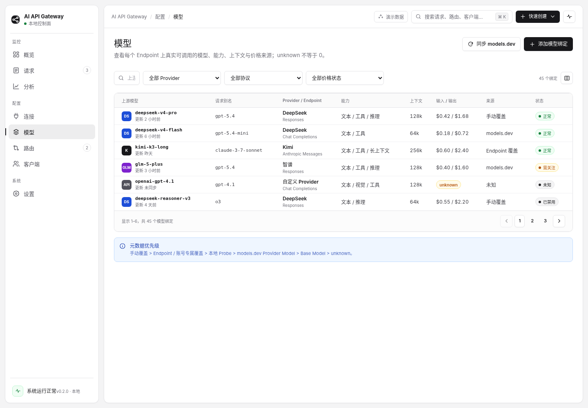

# 模型页



## 1. 页面目标

模型页展示每个 Endpoint 上真实可调用的模型绑定，而不是只维护一份抽象模型目录。用户应能判断能力、上下文、价格和元数据来源。

## 2. 主表格

核心列：

- 上游模型；
- 请求别名；
- Provider / Endpoint；
- 能力；
- 上下文；
- 输入 / 输出价格；
- 来源；
- 状态。

每行代表一个 `ProviderModelBinding`。相同基础模型在不同 Endpoint 上必须允许出现多行，因为能力、价格和稳定性可能不同。

## 3. 筛选与动作

筛选：搜索、Provider、协议、价格状态、能力、状态。

主操作：

- 同步 models.dev；
- 添加模型绑定。

同步使用 Dialog 展示来源、预计变更、覆盖规则和进度；不应无提示覆盖本地字段。

## 4. 元数据优先级

固定优先级：

```text
手动覆盖
> Endpoint / 账号专属覆盖
> 本地 Probe
> models.dev Provider Model
> models.dev Base Model
> unknown
```

每个字段都应保存来源，而不是整行只有一个模糊“来自 models.dev”。详情 Sheet 应逐字段展示当前值、来源、最后更新时间和覆盖入口。

## 5. 价格

- 价格按输入、缓存读取、输出等维度存储；
- 货币和计价单位明确；
- 手动覆盖不能被同步覆盖；
- 历史 Request/Attempt 使用当时 PricingSnapshot；
- unknown 使用明确 Badge，不能显示 `$0.00`；
- 未知价格的模型仍可路由，但界面必须持续提示成本不完整。

## 6. 模型详情 Sheet

包含：

- Provider / Endpoint / 模型 ID；
- 请求别名；
- 能力矩阵；
- 上下文与最大输出；
- 价格与来源；
- 最近 Probe；
- 使用该绑定的路由；
- 最近请求与错误；
- 手动覆盖与禁用。

详情属于上下文审阅和轻量编辑，使用宽版 Sheet；复杂能力 Probe 进入独立任务或 Dialog。

## 7. 状态

```text
正常 / 需关注 / 未验证 / unknown / 已禁用 / 同步过期
```

“需关注”必须有具体原因，例如价格未知、Probe 过期或 Endpoint 兼容性下降。

## 8. 当前交付

当前页面交付 Endpoint 级绑定列表和创建表单。Endpoint 选项来自连接目录并显示 Provider / Endpoint 名称，不回显内部 ID。选择 Endpoint 后，用户可显式选择绑定且未禁用的 Credential，请求可配置的模型目录路径，并从 OpenAI-compatible `data[].id` 结果中选择模型；选择后自动填充上游模型 ID 和空白显示名称。

模型发现由 Gateway 解密 Provider Credential 并发起受限上游请求，浏览器不持有完整 Secret。上游不可用、鉴权失败、响应过大或格式不兼容时保留手工输入，不创建耐久同步任务，也不清空已经编辑的字段。新绑定显示为“未验证”，能力与价格明确显示为 unknown。筛选、详情 Sheet、models.dev 同步、能力和价格编辑尚未交付。
