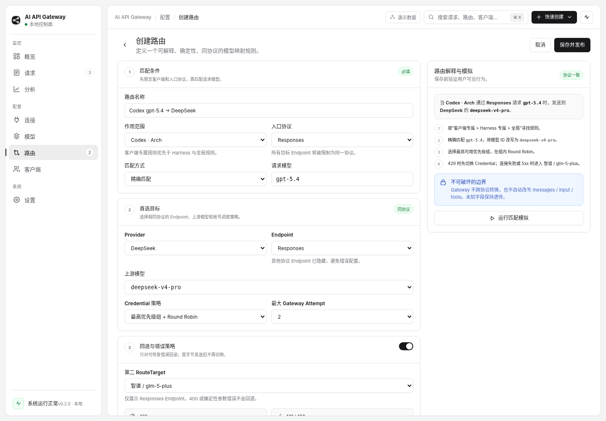

# 路由页



## 1. 页面目标

路由页让用户以确定性规则把“客户端 + 入口协议 + 请求模型”映射到同协议上游目标，并在发布前理解实际行为。

不使用节点连线画布。路由是有序规则和目标链，表格与表单比图形画布更适合精确比较和版本审阅。

## 2. 路由列表

页面结构：筛选 Toolbar、规则表、选中路由解释面板、全局协议约束 Alert。

表格核心列：

- 路由名称与匹配模式；
- 作用范围 / 协议；
- 目标链；
- Request 成功率；
- 回退率；
- 状态；
- 行级菜单。

规则按**实际匹配优先级**排序，而不是按创建时间。列表必须帮助用户发现遮蔽、冲突和未发布草稿。

## 3. 选中路由解释

右侧面板先用一句自然语言说明：

```text
当 Codex · Arch 通过 Responses 请求 gpt-5.4 时，
首选 DeepSeek / deepseek-v4-pro；
429 时切换同 Endpoint 备用 Credential，
连接失败或 5xx 时进入第二 RouteTarget。
```

随后展示匹配层级、目标链、Credential 策略、回退条件和协议约束。

## 4. 独立编辑器

复杂路由使用独立页面，采用两栏：

```text
配置表单（主栏） ┃ 路由解释与匹配模拟（侧栏）
```

侧栏在宽视口 Sticky；窄桌面时落到表单下方。

### 4.1 分区

1. 匹配条件；
2. 首选目标；
3. 回退与错误策略；
4. 高级设置。

每个分区有序号、标题、简短说明和状态。不要把所有字段放入一个巨大 Card。

### 4.2 匹配条件

字段：路由名称、作用范围、入口协议、匹配方式、请求模型。

匹配优先级固定：

```text
客户端专属 > Harness 专属 > 全局
精确 > 前缀 > Glob > 正则
显式优先级高 > 模式更长 > 创建时间更早
```

### 4.3 首选目标

选择 Provider、同协议 Endpoint、上游模型、Credential 策略和最大 Gateway Attempt。

一旦选择入口协议，其他协议 Endpoint 必须从选择器中隐藏或禁用并解释原因。

### 4.4 回退与错误策略

默认规则：

- 429：冷却当前 Credential，尝试同 Endpoint 下一个 Credential；
- 401/403：标记鉴权失败，可尝试其他 Credential；
- 连接失败、明确 5xx：可进入下一同协议 RouteTarget；
- 400 或确定性参数错误：不重试；
- 已发送响应首字节：不再切换 Credential 或 RouteTarget；
- 默认最多 2 个 Gateway Attempt。

### 4.5 高级设置

默认折叠。只允许有限 Header、Query 和 Body Patch。禁止提供跨协议转换或自动语义修复。

## 5. 路由解释与模拟

侧栏实时生成自然语言解释，并显示：

- 协议一致状态；
- 匹配层级；
- 模型 ID 改写；
- Credential 选择；
- 回退条件；
- 不可破坏边界。

“运行匹配模拟”接受一组客户端、协议、模型和可选状态输入，返回：命中规则、目标、账号、兼容性、被遮蔽规则和解释。

## 6. 保存与发布

保存流程：

```text
前端字段校验
→ 服务端配置编译
→ 协议与引用校验
→ 匹配冲突 / 遮蔽检查
→ 模拟样例
→ 生成不可变 Snapshot
→ 发布
```

按钮文案使用“保存并发布”。若只保存草稿，则必须明确显示草稿未影响数据面。

## 7. 高风险动作

删除、禁用或替换路由使用 AlertDialog，并展示：

- 影响的客户端；
- 最近 24h 请求量；
- 是否有备用规则；
- 回滚方式；
- 当前发布 Snapshot。
