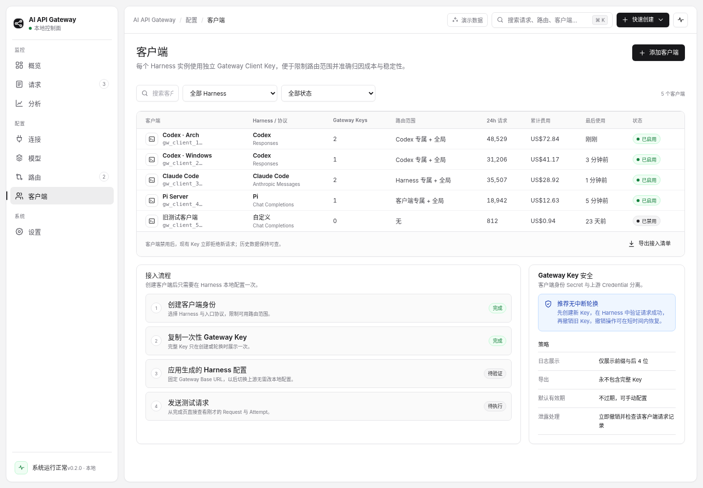

# 客户端页



## 1. 页面目标

每个 Harness 实例使用独立 Gateway Client Key。客户端页用于创建身份、限制路由范围、生成一次性 Key 和 Harness 配置，并独立归因成本与稳定性。

## 2. 主表格

核心列：

- 客户端；
- Harness / 协议；
- Gateway Key 数；
- 路由范围；
- 24h 请求；
- 累计费用；
- 最后使用；
- 状态。

每行代表一个具体实例，例如 `Codex · Arch` 与 `Codex · Windows` 分开，而不是只按 Harness 类型合并。

## 3. 创建客户端

使用 Dialog，步骤保持短：

1. 名称；
2. Harness Profile；
3. 入口协议；
4. 可用路由范围；
5. 创建。

创建完成后进入独立完成状态，展示：

- 一次性完整 Gateway Key；
- 复制按钮；
- Gateway Base URL；
- 生成的 Harness 配置；
- 发送测试请求；
- 安全说明。

关闭后完整 Key 无法再次查看。必须要求用户确认已复制，或允许立即下载仅含该 Key 的一次性安全文件，但普通导出永不包含完整 Key。

## 4. 客户端详情 Sheet

包含：

- 基本信息；
- Gateway Key 列表与状态；
- 路由范围；
- 生成配置；
- 最近请求；
- 使用量和费用；
- Key 轮换、撤销、禁用。

## 5. Key 轮换

推荐无中断流程：

```text
创建新 Key
→ 在 Harness 中替换
→ 发送测试请求并确认新 Key 生效
→ 撤销旧 Key
```

撤销前显示最近使用时间、来源客户端和影响。Key 泄露时提供“立即撤销并打开该客户端请求”动作。

## 6. 安全显示

- 列表只显示前缀与后 4 位；
- 复制完整 Key 仅存在于创建/轮换完成状态；
- 诊断、CSV、备份和截图不包含完整 Key；
- Gateway Client Key 不用于登录控制面；
- Provider Credential 不出现在客户端页。

## 7. 禁用

禁用客户端后，新请求立即拒绝；历史请求与分析保持可查。界面必须说明禁用影响，而不是只切换 Switch。
