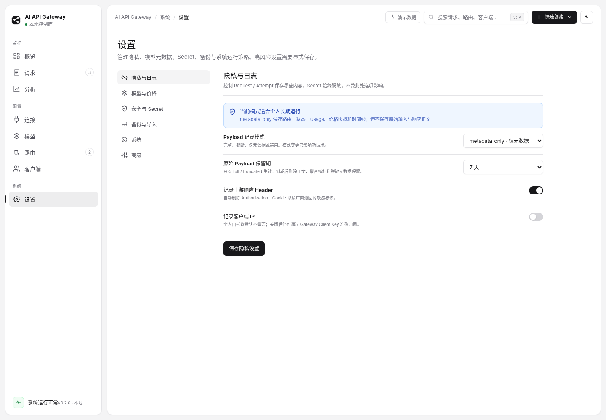

# 设置页



## 1. 页面目标

设置页管理隐私、模型元数据、Secret、备份和运行策略。它不是卡片网格，而是左侧本地导航和右侧开放式设置行。

## 2. 布局

```text
设置分区导航（约 220px） ┃ 当前分区内容（最大约 760px）
```

分区：

- 隐私与日志；
- 模型与价格；
- 安全与 Secret；
- 备份与导入；
- 系统；
- 高级。

当前分区进入 URL，刷新后保持。

## 3. 设置行

每行包含：

- 标题；
- 影响说明；
- 当前值或控件；
- 必要时的状态或验证信息。

设置行以 Separator 分隔，不为每项创建 Card。

## 4. 保存策略

自动保存：

- 侧栏折叠；
- 表格列显示与宽度；
- 主题；
- 非敏感本地偏好。

显式保存：

- Payload 记录模式；
- 保留期；
- Secret 与安全策略；
- models.dev 同步策略；
- 数据面监听地址；
- 日志级别；
- 高级路由默认值。

高风险设置必须有单独保存按钮和成功反馈。需要重启的变更必须标记“待重启”，不能自动中断当前请求。

## 5. 隐私与日志

支持：`full`、`truncated`、`metadata_only`、`disabled`。说明每种模式保存哪些内容，以及变更只影响新请求。

Secret 永远脱敏，不受 Payload 模式影响。记录客户端 IP 默认关闭，因为 Gateway Client Key 已能完成归因。

## 6. 模型与价格

配置 models.dev 同步频率和覆盖策略。同步失败时保留最后成功数据并标记 stale，不影响数据面路由。

unknown 价格保持强制策略，不提供“按 0 计算”选项。

## 7. 安全与 Secret

显示主密钥是否加载、最近解密自检、控制面访问范围和失效 Credential 策略。不能展示主密钥本身。

## 8. 备份与导入

配置备份默认不包含 Provider Credential 和 Gateway Client Key。导入前显示 schema、版本、引用和协议校验结果。

## 9. 高级

高级区明确列出不可破坏约束：禁止跨协议转换、禁止自动改写核心语义字段、禁止把 unknown 当作 0。高风险控件应有警告 Alert，而不是仅放在 Tooltip 中。
